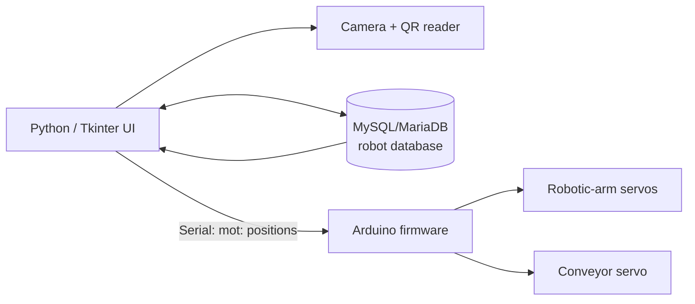

*This project was created as part of the Robotics I course by Christian Gómez.*

# Autonomous Pharmacy Robot

An academic prototype of an autonomous pharmacy workflow. The system combines a Python desktop interface, camera-based QR-code reading, a MySQL/MariaDB database of robot positions, serial communication, and Arduino firmware to coordinate a robotic arm and its programmed movement cycles.

> **Primary version:** [`proyecto_V2_/`](proyecto_V2_) is the most complete version in this repository. Its Python entry point is [`proyecto_V2_/main.py`](proyecto_V2_/main.py); run it from inside that directory so its local imports and cycle files resolve correctly. [`CodigoCompleto/`](CodigoCompleto) contains earlier, smaller experiments for the interface, camera, servo control, and Arduino sketches.

## Features implemented in the code

- Tkinter desktop interface for configuring and operating the robotic arm.
- Live camera capture and QR-code decoding with OpenCV and Pyzbar.
- Serial communication with the Arduino at 9600 baud (the current application code uses `COM8`).
- Storage, listing, creation, editing, and deletion of six-motor positions in the `robot.posicionmotores` table.
- Creation and execution of saved movement cycles, using the local `ciclos.txt` and `cantidadCiclos.txt` files.
- Arduino firmware that receives serial commands and coordinates the arm servos; the V2 firmware also defines a conveyor servo.

## System architecture



## Technologies

- Python with Tkinter
- OpenCV, Pyzbar, Pillow, NumPy, and Imutils
- PySerial
- MySQL/MariaDB through `mysql-connector-python` and `mysqlclient` (`MySQLdb`)
- Arduino C++ with the `Servo` and `Ticker` libraries

## Repository layout

```text
.
├── proyecto_V2_/                 # Main integrated prototype
│   ├── main.py                   # Python entry point
│   ├── ClaseProyectoV3.py        # UI, QR, database, cycles, serial control
│   ├── clasesBDPosiciones.py     # Position database access
│   ├── robot.sql                 # Database schema and initial motor positions
│   └── proy_mes3/                # Arduino firmware and support header
├── CodigoCompleto/               # Earlier standalone Python/Arduino modules
├── Proyecto R1/                  # Project photos and videos
├── TP ROBÓTICA1.pdf              # Course statement
├── requirements.txt
└── .gitignore
```

## Requirements

### Hardware

- A camera accessible to OpenCV (the code selects camera index `1`).
- An Arduino-compatible board connected over serial (the code uses `COM8`).
- The robotic arm servos described in [`proyecto_V2_/proy_mes3/proy_mes3.ino`](proyecto_V2_/proy_mes3/proy_mes3.ino), including the conveyor servo defined there.

### Software

- Python 3 and `pip`
- MySQL or MariaDB
- Arduino IDE with the `Servo` and `Ticker` libraries available

## Setup and execution

1. Create and activate a Python virtual environment (optional but recommended), then install the detected Python dependencies:

   ```bash
   python -m venv .venv
   # Windows: .venv\Scripts\activate
   # Linux/macOS: source .venv/bin/activate
   pip install -r requirements.txt
   ```

2. Create the `robot` database and load the supplied schema and position data. The dump defines the `posicionmotores` table used by the main application:

   ```bash
   mysql -u root -p -e "CREATE DATABASE robot;"
   mysql -u root -p robot < proyecto_V2_/robot.sql
   ```

   The current connection settings are hard-coded in `proyecto_V2_/clasesBDPosiciones.py` (`localhost`, user `root`, empty password, database `robot`). Adjust them locally if your MySQL/MariaDB installation differs.

3. Open `proyecto_V2_/proy_mes3/proy_mes3.ino` in the Arduino IDE, ensure `libManuel1.h` remains alongside it, select the board and serial port, then upload the firmware.

4. Update the serial port and camera index in `proyecto_V2_/ClaseProyectoV3.py` if your machine does not use `COM8` and camera `1`. Start the application from the main-version directory:

   ```bash
   cd proyecto_V2_
   python main.py
   ```

## Limitations

This is a course prototype, not a clinical or production pharmacy system. It depends on locally connected hardware and machine-specific camera, serial-port, and database settings. It has not been designed, validated, or approved for dispensing medication in real clinical environments.

## Author

Christian Gómez
